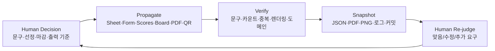

# Jaehong Loop: Human-Grounded Field Ops Loop

생성: 2026-07-04

## 정의

Jaehong Loop는 현장에서 사람이 계속 바꾸는 최종 판단을 기준으로, 입력·처리·표시·기록 산출물이 모두 같은 상태인지 에이전트가 반복 검증하고 즉시 동기화하는 운영 루프다.

짧게 말하면:

> 사람이 정한 최종 상태를 기준으로, 입력·처리·표시·기록이 모두 같은지 계속 맞추는 현장 운영 루프

Karpathy식 AutoResearch가 "실험을 만들고, 짧게 돌리고, 평가하고, 반복"하는 자동 연구 루프라면, Jaehong Loop는 "사람의 마지막 판단을 source of truth로 두고, 현장 산출물 전체가 그 판단을 따라갔는지 검증하고 반복"하는 라이브 운영 루프다.

## 핵심 원칙

1. 사람의 마지막 판단이 source of truth다.
2. 에이전트는 목표를 새로 정하지 않는다. 전파·대조·기록을 맡는다.
3. 입력, 처리, 표시, 기록은 반드시 같은 문구와 같은 상태를 공유해야 한다.
4. 발표용 화면과 기록용 화면은 분리한다.
5. 원문과 발표용 요약 라벨은 분리한다.
6. 결과를 말하기 전에 증거를 남긴다.

## 루프



## 오늘 0704 운영에서 확인된 패턴

### 1. 질문 루프

- 입력: A/B 실시간 Sheet 질문 탭
- 표시: 질문 보드, 선정질문 보드
- 기록: 질문 PDF/HTML, 질문 보드 캡쳐
- 검증: 전체 질문 수, 선정 질문 수, 발언자 필드, 전문가 전달용 형식

### 2. 의제 루프

- 입력: A/B 실시간 Sheet 의제 탭
- 표시:
  - 전체 의제 후보 17개: `/agenda-board-0704/?view=all`
  - 선정 의제 4개: `/agenda-board-0704/`
- 기록: 의제 PDF/HTML, 전체 후보 캡쳐, 선정 의제 캡쳐
- 검증: A조/B조 후보 수, 선정 marker, 최종 4개 문구

### 3. 투표 루프

- 입력: 선정 의제 4개
- 처리: Google Form 1~5점 척도 문항 생성
- 표시: QR, 응답 Form, 결과 버블레이스
- 기록: Scores 시트, 투표 구조 화면 캡쳐, 최종 버블레이스 캡쳐
- 검증: responseCount, uniqueVoterCount, duplicateDroppedCount, Scores short label

## 상태 모델

| 상태 | 의미 | 통과 기준 |
| --- | --- | --- |
| Draft | 사람이 문구/기준을 바꾸는 중 | 아직 배포·발표 금지 |
| Propagated | Sheet/Form/Board/PDF/Scores에 반영됨 | 경로별 문구가 같음 |
| Verified | 화면과 데이터가 대조됨 | 응답 수·카운트·라벨·렌더링 확인 |
| Frozen | 발표 직전 최종값 고정 | refresh 후 캡쳐 전 상태 |
| Captured | 이미지/JSON/PDF로 증거 저장 | 산출물 폴더에 파일 존재 |
| Archived | 문서·메모리·커밋까지 종료 | commit hash 존재 |

## 명령 설계

다음 운영에서는 아래 네 명령으로 Jaehong Loop를 구현한다.

### `preflight`

행사 시작 전 링크, QR, Sheet 권한, Form 문항, Cloudflare 배포 상태를 확인한다.

```powershell
pwsh -NoProfile -ExecutionPolicy Bypass -File scripts/jaehong-loop.ps1 preflight
```

### `watch`

현장 운영 중 Sheet/Form 응답을 주기적으로 읽고 보드, PDF, Scores를 갱신한다.

```powershell
pwsh -NoProfile -ExecutionPolicy Bypass -File scripts/jaehong-loop.ps1 watch -IntervalSeconds 10
```

### `finalize`

발표 직전 사람이 확정한 문구와 선정 기준이 모든 산출물에 같은지 대조하고 결과 화면을 고정한다.

```powershell
pwsh -NoProfile -ExecutionPolicy Bypass -File scripts/jaehong-loop.ps1 finalize -Capture
```

### `archive`

질문, 의제, 투표, 버블레이스, 운영 화면을 캡쳐하고 회고/메모리/커밋까지 닫는다.

```powershell
pwsh -NoProfile -ExecutionPolicy Bypass -File scripts/jaehong-loop.ps1 archive
```

## 자동 평가 항목

| 구분 | 자동 확인 | 실패 시 |
| --- | --- | --- |
| Sheet | 탭/컬럼/행 수 | 입력 구조 수정 요청 |
| Form | 문항 수, 필수 여부, 원문 | promote 재실행 |
| Board | 전체/선정 view 분리 | view mode 수정 |
| PDF | 최신 생성 시각, 건수 | export 재실행 |
| Scores | name/short/점수/응답 수 | refresh 재실행 |
| Result | 버블레이스 overlay 없음 | capture final 재실행 |
| Domain | preview/custom domain 일치 | preview 임시 사용 또는 재검증 |
| Archive | PNG/PDF/JSON/docs/memory/commit | archive 재실행 |

## 0704에서 나온 설계 규칙

- 화면은 하나로 줄이지 않는다. 전체 후보와 선정 후보는 다른 사용 맥락이다.
- 투표용 원문과 발표용 라벨은 다른 데이터 필드다.
- "지금 맞다"는 Sheet, Form, Scores, Board, PDF, 캡쳐가 모두 맞을 때만 말한다.
- QR은 현장 투입 전 항상 확대 모달과 실제 응답 URL을 확인한다.
- 캡쳐는 발표 화면 기준과 기록용 full-page 기준을 모두 고려한다.
- Cloudflare 배포는 preview와 custom domain이 동시에 맞는지 확인한다.

## 다음 구현

1. `scripts/jaehong-loop.ps1`
2. `scripts/verify-0704-final-wording.ps1`
3. `scripts/capture-0704-live-artifacts.mjs`
4. `evaluation/jaehong-loop-report.json`
5. `docs/jaehong-loop-runbook.md`
